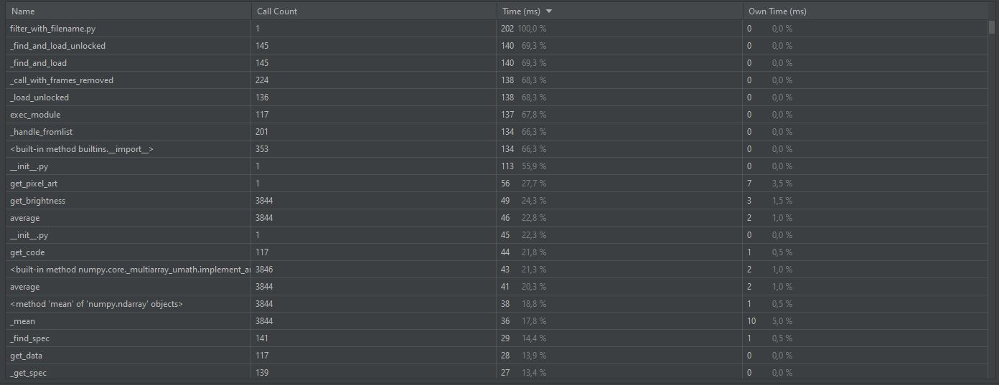
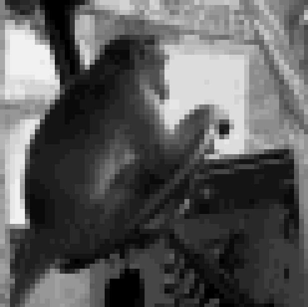
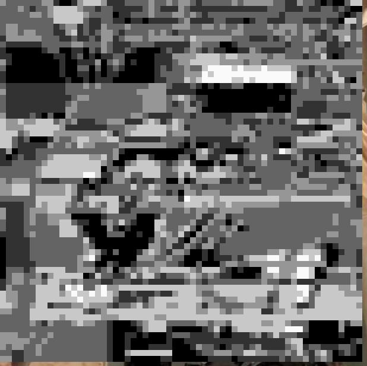
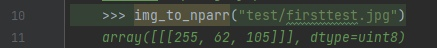
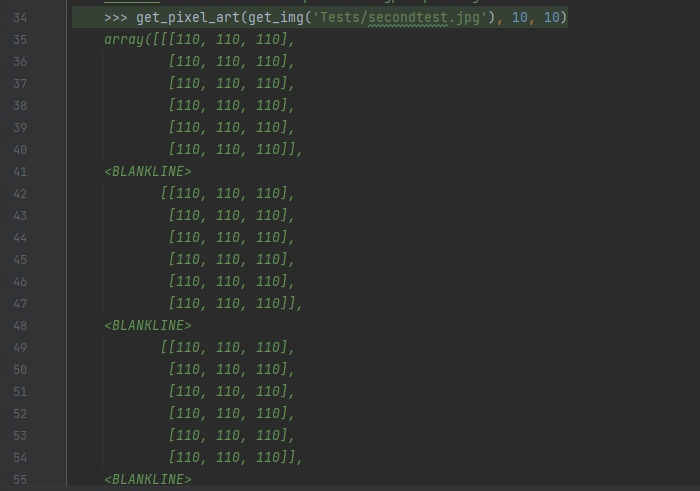

# PuCharmWork
 
Время выполнения нового filter.py:

Время выполнения старого old_filter.py:

Разница во времени вызвана тем, что в новом варианте большая часть времени затричивается
на передачу данных пользователем.

Время выполения filter_with_filename.py:

Уменьшение времени работы файла вызвана тем, что пользователь не вводит данные.Также увеличению 
скорости работы способствует использование библиотеки numpy вместо циклов.

Изображение до преобразования:

Результат преобразования filter_with_filename.py:

Результат преобразования old_filter.py:

Doc tests:

get_img:

get_pixel_art:

