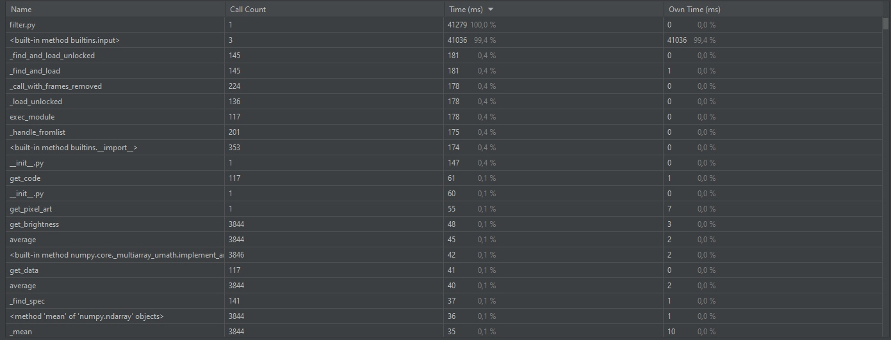
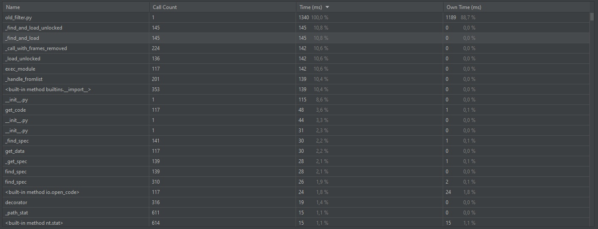

# PuCharmWork
 
Время выполнения нового filter.py:

Время выполнения старого old_filter.py:

Разница во времени вызвана тем, что в новом варианте большая часть времени затричивается
на передачу данных пользователем.
